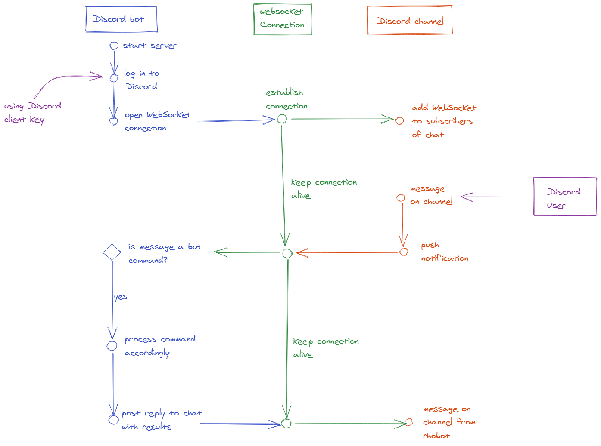

Discord bots login to Discord, similar to normal users and maintain a connection to Discord using WebSockets.

Any messages sent to channels that the Discord bot is a member of will get pushed to the bot via the open WebSocket connection.

The bot then needs to decide decide whether or not to react to the message.

Communication back to to Discord is often done by posting a message from the bot back to the channel that triggered the bot's message.

