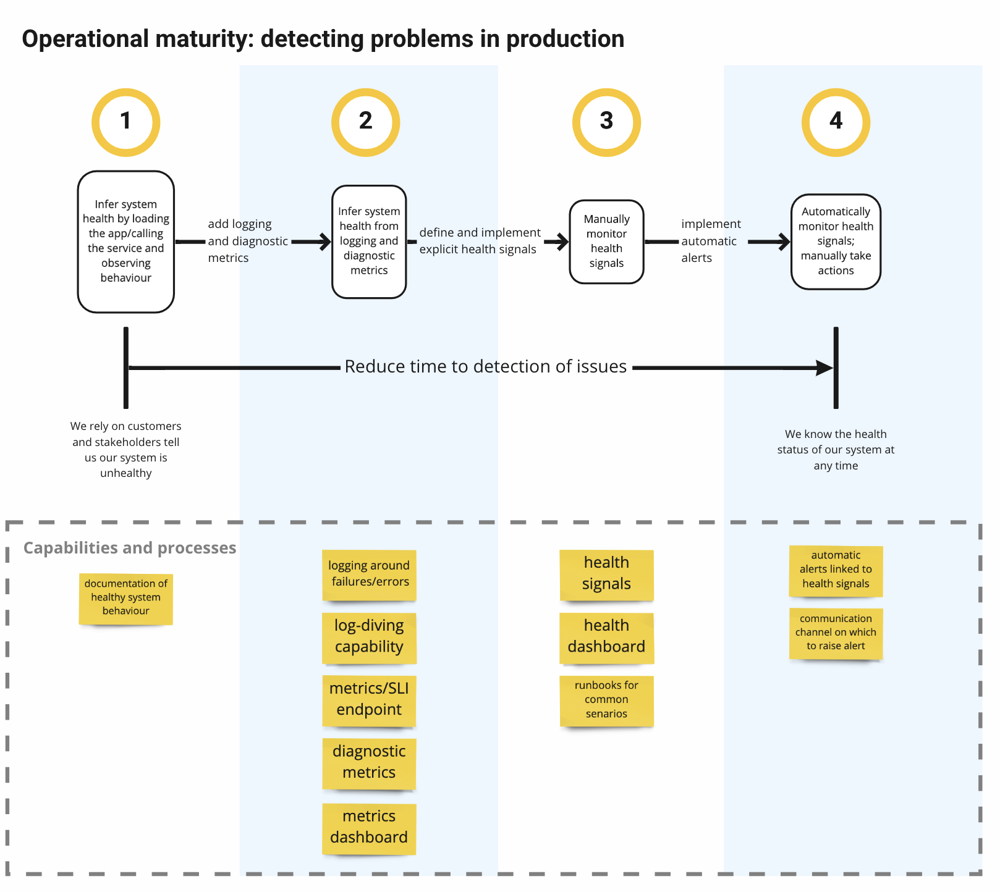
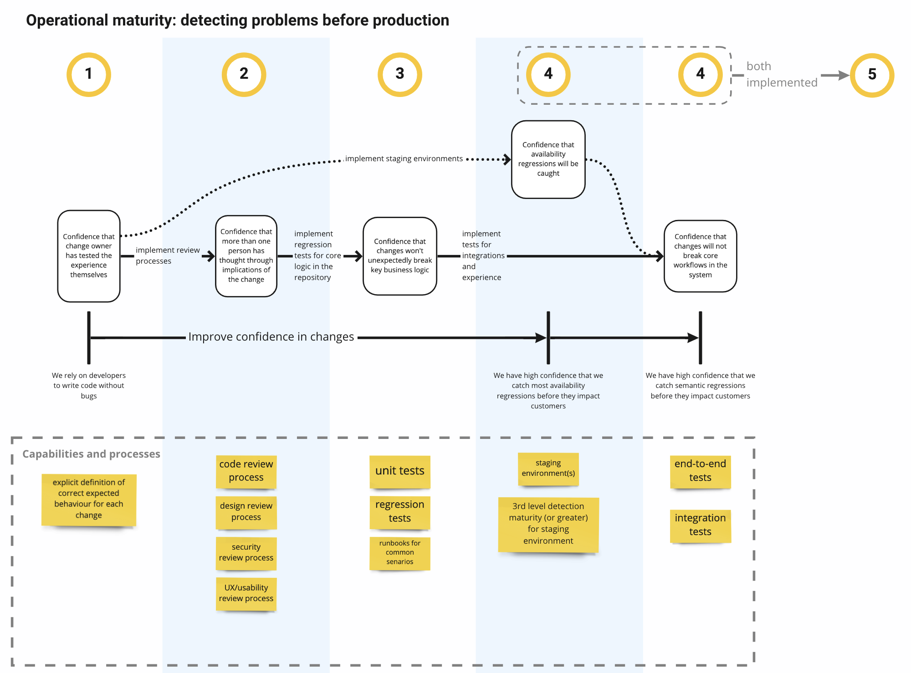
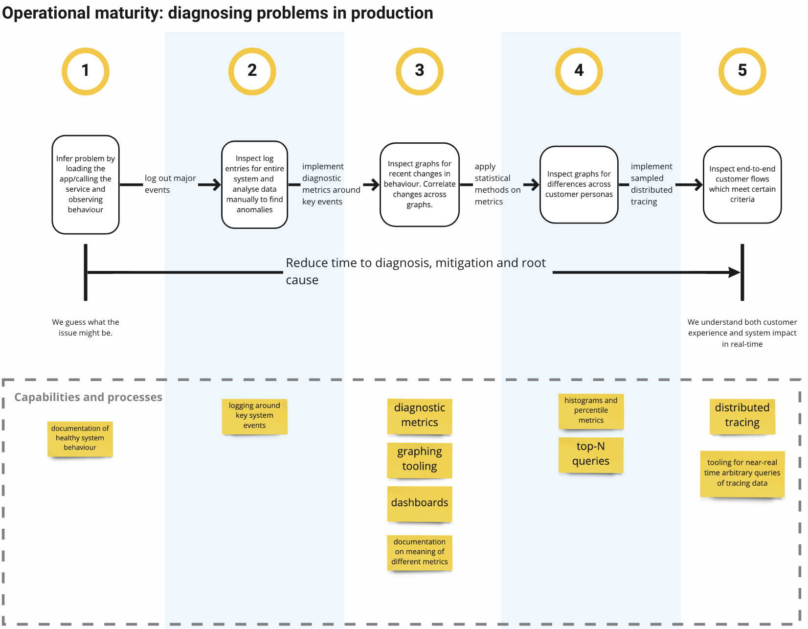
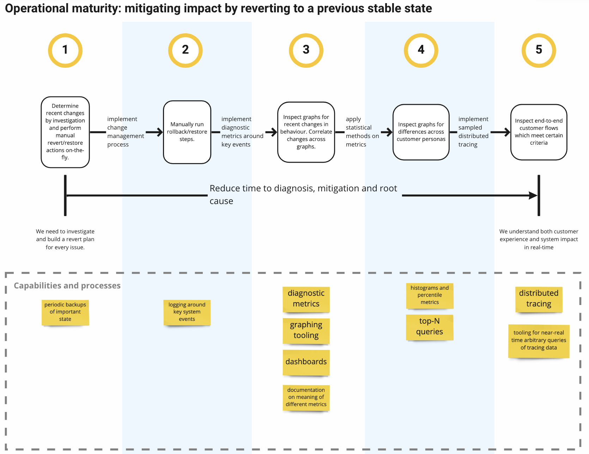
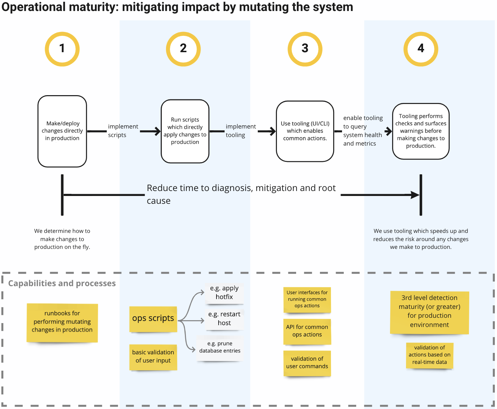

import { Link } from "gatsby"
import { Card } from "../components"

This document describes a method for thinking through operational capabilities of our systems to get a high-level understanding of where we can invest and what it would cost us.

# Problem

Investment into the operational capabilites of our systems is important to enable us to maintain our systems in a healthy state.
Despite the importance of this work, I've previously found it difficult to prioritise and track operational investment with respect to other work on our roadmap.

It would be useful to have a systematic approach with which to analyze our systems so that we can determine and prioritize the next operational investments of our systems.

# Glossary

- **operations** - the work needed to keep a system healthy while doing what _it is currently doing_ at _its current scale_.
- **scaling** - the work needed to enable the system to perform what _it is currently doing_ at _a larger scale_. For this we think big; 2x,5x,10x, or 100x the current load.
- **features** - the work needed to _add new capabilites_ to the system.

In this article we are specifically looking at **operations**.

I added definitions for scalability and features to clarify what operations is _not_.
Investments into both scalability and feature-work both require their own approaches, which are beyond the scope of this article.

<Card heading="Recommended reading">

This article also builds on terms and concepts introduced in <Link to="/articles/operational-observability">Operational Observability</Link>.
I recommend that you skim through that article before continuing.

</Card>

# Axes of operational investment

Before jumping into solution-mode I think it is useful to think about operations from first-principles
and come up with some explicit definitions for what we're trying to achieve by making these investments.

At its core, operating a system is the act of keeping its current state healthy.
To do this, we conceptually need 3 core abilities:

1. **Detecting problems**
1. **Diagnosing problems**
1. **Mitigating impact**

I've found that further breaking up detection and mitigation gives a decomposition that is more useful in practice.
This gives us 5 "axes" that we can invest in to make operations more effective, cheaper, more reliable and scalable:

1. **Detecting problems in production** - investing in this reduces our time to detection for issues that are actively affecting customers.
1. **Detecting problems before they reach production** - investing in this reduces the risk of releasing issues with new changes.
1. **Diagnosing issues in production** - investing in this reduces the time it takes to determine what an actual issue is.
1. **Mitigating impact by reverting to a previously-known stable state** - investing in this reduces the time it takes to mitigate an issue in production for issues that can be solved with a rollback.
1. **Mitigating impact by mutating the system** - investing in this reduces the time it takes to mitigate an issue in production for issues that require a fix/change to be deployed or applied to our system.

# Building and applying a capability roadmap

Armed with a concrete understanding of our investment goals we now need to build a plan for how we can practically achieve them.

In these next sections I want to lay out a general approach for building and using a capability roadmap.
The thinking is that systems will have differing operational needs depending on their context so,
instead of trying to build a roadmap that will fit all systems,
we will develop a general approach for developing a roadmap that can be tweaked for individual systems.

## 1 Levels of capability

In practice investments are easier to plan, prioritize, and execute if we do them iteratively.
For each of our axes up investment in our axes into

For each of axis of operational investment, we want to describe levels for our ability to operate on that axis.
We start with asking ourselves the bare minimum capability would look like for this axis, and what the highest level of sophistication would be for this axis.
We then try to identify a series of levels that can take us from the bare-minimum level to the highest level.

It is important for each level to describe a _complete_ capability without prescribing how to achieve that capability.

```yaml
# ✔ good: describes a complete capability without describing how it's achieved
We can infer root causes from individual system events

# ❌ bad: does not describe a complete capability (pushing logs off hosts isn't useful by itself)
# and describes a technical solution (a log pushing system)
We have a system to push logs off of cloud hosts
```

Once we're done, we should have a set of levels/milestones for each axis.

```yaml
# Example
Axis: Diagnosing issues in production
Levels:
  1. Capability: We infer issues by noticing differences in external behaviour of our system
  2. Capability: We can filter and process key system events
  3. Capability: We can correlate changes in behaviour of multiple system events
  4. Capability: We have aggregations of current top causes of issues in our system
  5. Capability: We have a near-realtime, distributed trace of issues and key events in our system
```

We now have some high-level iterations and milestones. These give us a good sense of what there is to gain by investing in a specific axis.

## 3 Component breakdown

For each level of capability, we can now determine identify the high-level components we would need to implement to achieve this capability.

```yaml
# Example
Axis: Diagnosing issues in production
Levels:
    # ...
    2.  Capability: We can filter and process key system events
        Components:
            Event logs in our web service: system events written as log entries
            Log pusher system: logs pushed from service hosts to a central location
            Log dive system: ability to filter/search logs pushed from our hosts
            Runbook: a reference of how to identify common issues from our logs
    # ...
```

At this point we now have tool that shows us a holistic view of what units of work that _could_ be built if we want to invested in operational capabilities.
We'll call this tool our **capability roadmap**. We now need to use this tool to take a look at our actual system.

## 4 Analyze a specific system

For each axis and capability, analyze what components currently exist in our system.
This, along with some of our own context, should give us a good indication of what our current level of capability is.
From here we can use our tool to identify the components we need to build to take us to the next level.
It is now also possible to estimate the work implement/integrate each of these components.

At this point we now have an idea of the costs needed to take us to the next level for each of our axes.

## 5 Cost vs benefit and prioritization

Now that we have an idea of our current capabilities, an idea of what the next cabability will give us, and an idea of the cost to get us to the next capability,
we should be able to make a decision driven by cost vs. benefit about whether or not we want to invest into any of our axes.
This cost/benefit should also give us a good sense of which axis we want to invest in first (which will depend on our context).

# Deep example: Web-service capability roadmap

## Detecting problems in production

Investing in this axis reduces the time and effort needed to detect issues.



```yaml
Axis: Detecting problems in production
Levels:
    1.  Capability: >
            We compare actual behaviour against documented behaviour to infer system 
            health.
        Components:
            - Documentation of healthy system behaviour
            - Runbook for common error senarios
    2.  Capability: >
            We infer system health by looking at the behaviour of diagnostic events 
            emitted by the system.
        Components:
            - System logs for key events
            - Ability to dive into logs
            - Diagnostic metrics pushed by the system
            - Dashboard for diagnostic metrics
    3.  Capability: >
            We determine system health through dedicated system health signals.
        Components:
            - Health signals
            - Health dashboard with overview of health signals
    4.  Capability: >
            We automatically alarm and roll back recent changes using health signals.
        Components:
            - automatic alerts linked to health signals
            - communication channel in which to publish alerts
```

## Detecting problems before production

Investing in this axis improves our confidence that changes will not cause regression in our existing behaviour.

There can be two types of impact from new changes, which we want to catch:

- **availability** - when a change causes errors/crashes in the system or degrades the performance to where it affects usability
- **semantic** - when a change causes incorrect behaviour without affecting the availablity of the system

Availability regressions can be caught before they reach production using staging/pre-prod environments on which we monitor system health.

Semantic regressions are more complicated to catch; the majority of these levels of investment address this style of problem.



```yaml
Axis: Detecting problems before production
Levels:
    1.  Capability: >
            We test our implementations against explicit definitions of correct 
            semantic behaviour.
        Components:
            - explicit definitions of correct behaviour for each change
    2.  Capability: >
            We have review processes for our designs and implementations.
        Components:
            - code review process
            - design review process
            - security review process
            - UX/usability review process
    3.  Capability: >
            We have regression tests in our implementations for correct semantic 
            behaviour.
        Components:
            - unit tests
            - regression tests
    4.  Capability: >
            We have a pre-production version of our system that we deploy and test 
            new changes in.
        Components:
            - pre-prod environment in deployment pipeline before production deployments
    5.  Capability: >
            We have automated testing of correct semantic behaviour in pre-production.
        Components:
            - end-to-end tests running on pre-production before deployment to production
    6.  Capability: >
            We have automated testing of availability in pre-production
        Components:
            - health signals in pre-production that match those in production
            - integration tests running on pre-production before deployment to production
```

## Diagnosing issues in production



```yaml
Axis: Diagnosing issues in production
Levels:
    1.  Capability: >
            We infer issues by noticing differences in external behaviour of our system
        Components:
            - Runbook of how to diagnose common errors from external system behvaviour
    2.  Capability: >
            We can filter and process key system events
        Components:
            - System logs for key events
            - Ability to dive into logs
            - Runbook of how to diagnose common errors from system logs
    3.  Capability: >
            We can correlate changes in behaviour of multiple system events
        Components:
            - Diagnostic metrics
            - Diagnostic metric dashboard
            - Runbook of how to diagnose common errors from diagnostic metrics
    4.  Capability: >
            We have aggregations of current top causes of issues in our system
        Components:
            - Diagnostic metric aggregations (historograms/percentiles)
            - Pre-prepared queries that show top causes of errors in the system
    5.  Capability: >
            We can track requests through our system in near-realtime
        Components:
            - Distributed tracing integrated throughout system
            - Tooling for querying/filtering distributed traces in near-realtime
```


## Mitigating issues by reverting to previous stable state



```yaml
Axis: Mitigating issues by reverting to previous stable state
Levels:
    1.  Capability: >
            We have previous versions of state that we use to manually roll back
        Components:
            - Previous versions of production code
            - Runbook for how to roll back to a previous version of production code
            - Regular backups of databases/system state
            - Runbook for how to roll back to a backed up state
    2.  Capability: >
            We programmatically run revert/restore actions
        Components:
            - Scripts that can execute common backup/restore/revert actions
    3.  Capability: > 
            We automatically roll back impactful changes when degredation is detected
        Components:
            - System health signals
            - Ability to detect if a change was deployed recently
            - Ability to trigger a rollback action from a health signal
```


## Mitigating issues by mutating production



```yaml
Axis: Mitigating issues by mutating production
Levels:
    1.  Capability: >
            We run mutating actions manually against production
        Components:
            - Runbooks for how production can be mutated
    2.  Capability: >
            We have a processes to guide us through safely mutating production
        Components:
            - Process for determining when we can manually mutate production
            - Scripts for common or high-risk mutating actions
            - Runbooks for when/how to run scripts against production
    3.  Capability: >
            We have dedicated tooling for making changes to production
        Components:
            - WebUI or CLI that exposes possible mutating actions against production
            - Audits that tracks when changes are made and by whom
    4.  Capability: >
            We have contextual validation of mutating actions
        Components:
            - Tooling is aware of system health
            - Tooling raises warnings/adds friction for particularly risky operations
```

# Conclusion

Building and applying an operational capability roadmap can give us a holistic view of what operational investments we can make to our systems.
By defining capabilities and by breaking down the components we need to attain those capabilities, 
we gain an understanding of the cost vs benefit of these investments. 
We can then take an informed decision about whether or not to invest further and, if we do, where to prioritize these further investements.
