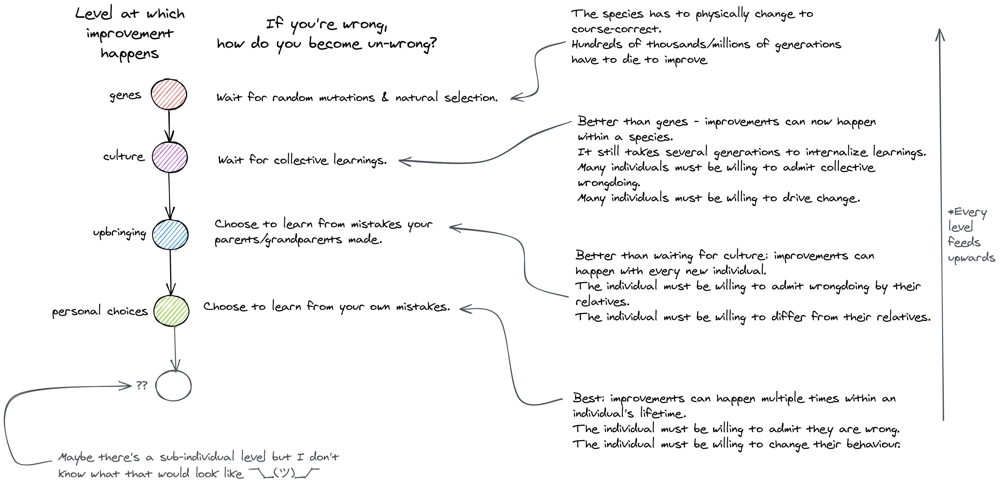

You could think of "progress" as the process of becoming less and less wrong.
The less wrong you are, the better you fare.

Here's a thought exercise for levels at which progress can happen in our societies:

The most effective mechanism for progress is the ability of an individual to self-correct.
For this to be effective, one needs to consciously acknowledge that you will often be wrong
and that one needs to actively seek to constantly tweak their own behaviour to adapt to new
information if they are to improve.
